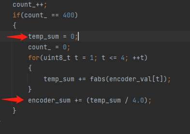
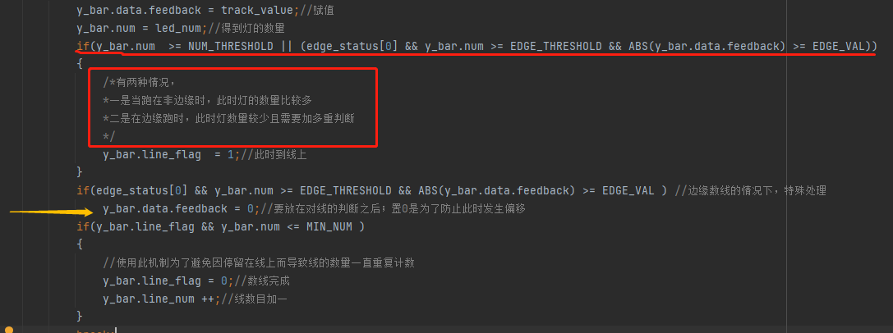
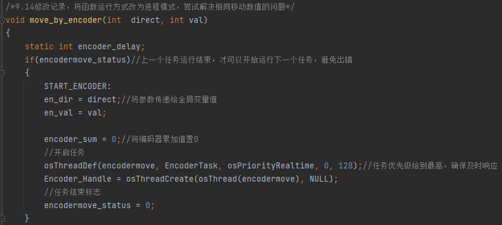
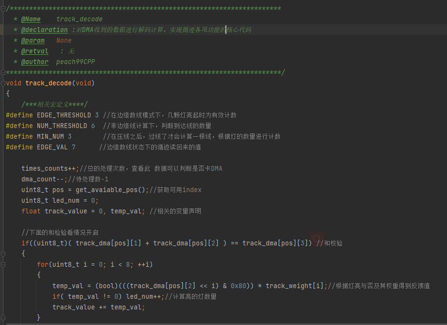
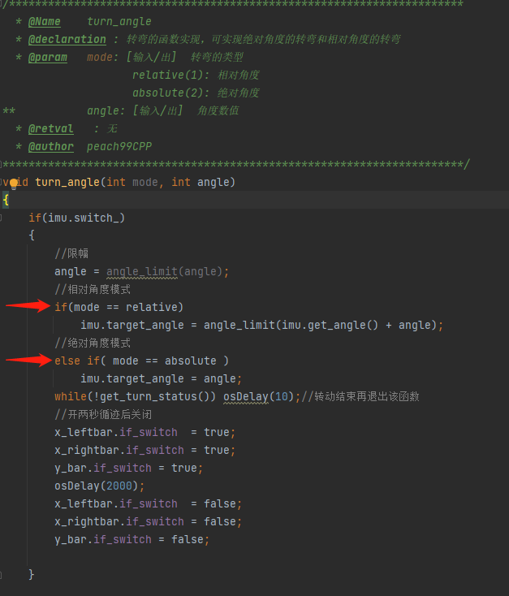
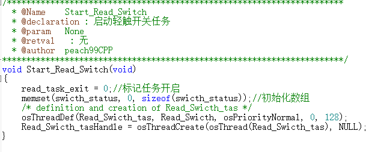

# 每日进度报告
## 20219.15
  ### 1. 今日完善的BUG：
   - **编码器中对于循环累计值的清零操作，解决了使用编码器运行时距离不同的错误**
     
   - **修正了在边缘计数时 提前处理反馈值导致不满足计数条件而无法读到线的问题**
   
   - **使用守护进程的方案来执行 ***move by encoder*** 函数**
   
---
   ### 2.今日增加内容：
   - 对 循迹版的函数进行了规范化处理，增加了***函数功能说明和必要的注释***
     
   - 增加了陀螺仪的转角模式的选择：**以上电时的角度为默认0度** 

          1.转动到 xx 角度
          2.与当前角度相对的 xx 角度
     #### 在函数入口参数增加了模式选择以兼容两种模式

   - - -
## 2021.9.16
### 今日工作内容：
- 增加了轻触开关的底层状态读取函数

- 在原有的基础上，把轻触开关的运行转为**任务形式**，并设置开启和关闭的API
```C
typedef enum
{
    err = -1,
    off ,
    on,
} status_;

int Get_Switch_Status(int id);
void Start_Read_Switch(void);
void Exit_Swicth_Read(void);
void Wait_Switches(int dir);
```
- 优化了超声波循迹模块的运行逻辑，提供**对外开关接口**，降低*程序复杂度*
```c
/**********************************************************************
  * @Name    avoid_task
  * @declaration : 任务的实现函数
  * @param   argument: [输入/出]
  * @retval   : 无
  * @author  peach99CPP
***********************************************************************/
void avoid_task(void const * argument)
{
    while(!avoid_task_exit)//当函数运行时
    {
        //不断拉高再拉低信号脚。来触发超声波测量
        HAL_GPIO_WritePin(US_SEND_GPIO_Port, US_SEND_Pin, GPIO_PIN_SET);
        delay_us(15);
        HAL_GPIO_WritePin(US_SEND_GPIO_Port, US_SEND_Pin, GPIO_PIN_RESET);
        osDelay(50);
    }
    vTaskDelete(avoid_taskHandle);//从任务列表中删除该任务
    avoid_taskHandle = NULL;//句柄置空
}

```

- ### ***进一步提高程序的代码规范性，完善了部分未有系统注释说明的函数***
- --
###对上述的改动进行`调试`，确保上述改动不会产生新问题

## 2021.9.19
### 今日工作内容
完成大部分[自动分拣编程组报告](https://github.com/Peach99CPP/motor/edit/master/report/structure.md)
